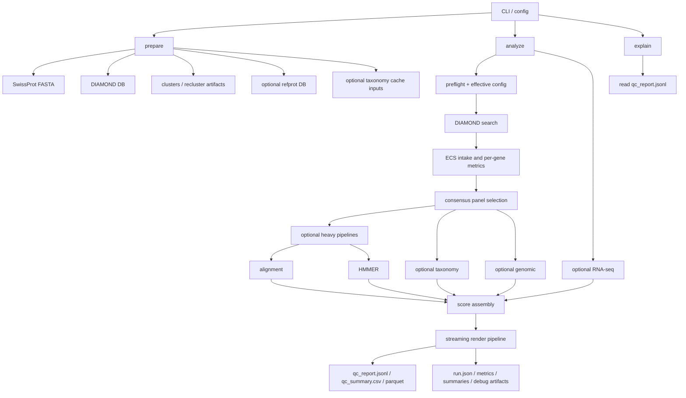

# AnnoQC Architecture

This document describes the repository-level architecture of AnnoQC as it exists today. It supersedes the older, scoring-only view in [`architecture.md`](/weka/users/guhjo98p/AnnoQC/architecture.md).

## System Shape

AnnoQC is a Rust CLI with three main layers:

1. Data preparation and indexing
2. Analysis and scoring
3. Rendering, observability, and debugging outputs

The center of gravity is [`src/main.rs`](/weka/users/guhjo98p/AnnoQC/src/main.rs), which owns CLI parsing, effective-config resolution, stage orchestration, and final record rendering. Heavy and high-cardinality work is delegated to focused modules and to Bevy ECS runners in [`src/ecs.rs`](/weka/users/guhjo98p/AnnoQC/src/ecs.rs).

At a high level, the tool is designed around one unit of work: a gene or protein sequence. Most evidence is computed per gene, joined into a `RenderContext`, scored, and then flushed as streaming JSONL/CSV/Parquet output.

## CLI Surface

The CLI subcommands are defined in [`src/main.rs`](/weka/users/guhjo98p/AnnoQC/src/main.rs):

- `prepare`: download and build reference artifacts
- `analyze`: run the QC pipeline
- `explain`: inspect one rendered gene from a prior run
- `taxonomy-cache`: build accession-to-taxid caches from FASTA
- `refprot-index`: inspect reference-proteome metadata
- `taxonomy-count`: summarize lineage coverage in the reference-proteome catalog

In practice, `prepare` and `analyze` are the architectural backbone. The others are support and diagnostics tooling.

## Major Runtime Paths

### `prepare`

`prepare` is the artifact builder. It downloads SwissProt inputs, builds the DIAMOND database, runs clustering/reclustering, and can assemble a taxonomy-aware reference-proteome sidecar. It is checkpointed so long-running or interrupted steps can be resumed rather than recomputed.

Key characteristics:

- External-tool oriented: DIAMOND is the primary engine here
- Artifact producing: outputs become inputs to `analyze`
- Network aware: downloads support retries, conditional requests, and partial resume
- Taxonomy aware: rebuilt databases are verified for taxonomy metadata before reuse

Relevant code and docs:

- [`src/main.rs`](/weka/users/guhjo98p/AnnoQC/src/main.rs)
- [`src/diamond.rs`](/weka/users/guhjo98p/AnnoQC/src/diamond.rs)
- [`src/checkpoint.rs`](/weka/users/guhjo98p/AnnoQC/src/checkpoint.rs)
- [`src/refprot.rs`](/weka/users/guhjo98p/AnnoQC/src/refprot.rs)
- [`book/src/prepare.md`](/weka/users/guhjo98p/AnnoQC/book/src/prepare.md)

Primary outputs:

- `uniprot_sprot.fasta.gz`
- `uniprot_sprot.dmnd`
- `clusters`, `clusters.realign`, `clusters.recluster`
- `share/refprot/...` reference-proteome inputs and databases

### `analyze`

`analyze` is a staged pipeline rather than a single pass. It resolves configuration, verifies tools, runs or reuses DIAMOND, computes per-gene evidence, optionally launches heavier evidence pipelines, computes scores, and finally streams records to output files.

The stages in [`src/main.rs`](/weka/users/guhjo98p/AnnoQC/src/main.rs) are roughly:

1. Load config and apply profile overrides
2. Preflight external tools and database paths
3. Run DIAMOND in single or batch mode
4. Parse DIAMOND output into per-gene summaries and grouped hit rows
5. Run ECS intake for basic per-gene metrics
6. Compute intrinsic sequence metrics
7. Build consensus panels from homology evidence
8. Run optional heavy pipelines:
   - alignment via MAFFT or SPOA
   - domain scanning via HMMER
9. Run optional taxonomy, genomic-context, structural-variant, and RNA-seq analyses
10. Build weighted scores and classifications
11. Stream JSONL/CSV/Parquet records and sidecar summaries

### `explain`

`explain` is intentionally thin. It reads prior `qc_report.jsonl` output and prints a human-readable breakdown for a single gene. That keeps explanation logic downstream of the main renderer instead of recomputing evidence.

## ECS Execution Model

AnnoQC uses Bevy 0.17 ECS as an execution framework, not as an application framework. [`src/ecs.rs`](/weka/users/guhjo98p/AnnoQC/src/ecs.rs) defines three distinct runners:

- `run_scheduler`: intake and lightweight per-gene work
- `run_heavy_pipelines`: bounded async execution for alignments and hmmscan jobs
- `run_render_pipeline`: streaming emission of final per-gene records

This separation is important:

- Intake work scales by gene count and stays lightweight
- Heavy pipelines scale by selected panels and external-tool cost
- Rendering scales by output bandwidth and must preserve order and resume semantics

The ECS design relies on:

- Bevy resources for global state and queues
- async tasks on `AsyncComputeTaskPool`
- deterministic flushing through ordered indices
- entity despawn after completion to keep memory flat

This matches the guidance already captured in [`BEVY_GUIDE.md`](/weka/users/guhjo98p/AnnoQC/BEVY_GUIDE.md): the CLI drives `app.update()` in a loop until a `CompletionState` resource is marked finished.

## Core Data Flow in `analyze`

### 1. Homology acquisition

[`src/diamond.rs`](/weka/users/guhjo98p/AnnoQC/src/diamond.rs) owns:

- DIAMOND command construction
- single-shot and chunked batch execution
- status and stderr sidecars during long runs
- TSV parsing into:
  - per-gene top-hit summaries
  - grouped rows for consensus and downstream diagnostics

DIAMOND is the foundation for most downstream analysis. Even when optional features are disabled, homology still anchors panel selection, length checks, top-hit summaries, and baseline scoring.

### 2. Lightweight per-gene evidence

Three modules provide the initial evidence base:

- [`src/metrics.rs`](/weka/users/guhjo98p/AnnoQC/src/metrics.rs): intrinsic sequence metrics
- [`src/orf.rs`](/weka/users/guhjo98p/AnnoQC/src/orf.rs): ORF translation for nucleotide-oriented inputs
- [`src/ecs.rs`](/weka/users/guhjo98p/AnnoQC/src/ecs.rs): intake scheduling and per-gene length/hit bookkeeping

This stage is cheap enough to run broadly before expensive optional analysis.

### 3. Consensus panel selection

Consensus selection is the architectural hinge between raw homology and richer evidence. [`src/consensus.rs`](/weka/users/guhjo98p/AnnoQC/src/consensus.rs) aggregates HSPs by subject, computes coverage-aware summaries, and selects a per-gene panel under configurable constraints:

- minimum and maximum panel size
- coverage and identity filters
- length-ratio windows
- redundancy caps
- taxonomy-aware diversity caps
- cluster backfill and reference-proteome rescue

Outputs from this stage feed:

- length consistency
- alignment jobs
- HMMER comparison sets
- taxonomy summaries
- provenance/debug artifacts such as `panel_debug.csv`, `panel_agg_debug.csv`, and `panel_sources.csv`

### 4. Optional heavy evidence

Heavy evidence is fan-out work launched only when the inputs and config support it.

Alignment:

- [`src/mafft.rs`](/weka/users/guhjo98p/AnnoQC/src/mafft.rs)
- supports external MAFFT and in-process SPOA backends
- computes conserved-region, divergence, termini, gap-run, and exon/intron-like signals

Domains:

- [`src/hmmer.rs`](/weka/users/guhjo98p/AnnoQC/src/hmmer.rs)
- runs `hmmscan`
- parses domtblout
- computes domain-strength and architecture diagnostics
- performs orphan-domain analysis
- supports optional Pfam clan collapsing

The heavy runner in [`src/ecs.rs`](/weka/users/guhjo98p/AnnoQC/src/ecs.rs) explicitly manages CPU budgets so alignments and hmmscan do not oversubscribe the machine.

### 5. Optional contextual evidence

These are modular add-ons rather than prerequisites:

- [`src/taxonomy.rs`](/weka/users/guhjo98p/AnnoQC/src/taxonomy.rs): taxid lookup, lineage reconstruction, panel consensus, contamination/congruence summaries
- [`src/genomic.rs`](/weka/users/guhjo98p/AnnoQC/src/genomic.rs): splice-site and intron diagnostics from GFF + genome FASTA
- [`src/structvar.rs`](/weka/users/guhjo98p/AnnoQC/src/structvar.rs): fusion/split/internal-duplication heuristics from DIAMOND tiling patterns
- [`src/rnaseq.rs`](/weka/users/guhjo98p/AnnoQC/src/rnaseq.rs): expression-table parsing and RNA-seq derived metrics

These modules are intentionally decoupled so they can be turned on independently and joined late.

### 6. Scoring, calibration, and penalties

Scoring is distributed across a few modules:

- [`src/scoring.rs`](/weka/users/guhjo98p/AnnoQC/src/scoring.rs): core pillar score functions
- [`src/length.rs`](/weka/users/guhjo98p/AnnoQC/src/length.rs): length consistency scoring
- [`src/hmmer.rs`](/weka/users/guhjo98p/AnnoQC/src/hmmer.rs): domain architecture and orphan-domain scoring helpers
- [`src/main.rs`](/weka/users/guhjo98p/AnnoQC/src/main.rs): score assembly, weighting, calibration, and classification

Important architectural choices:

- pillar presence is explicit; missing evidence is usually removed from the denominator
- some missing pillars still count as penalties to avoid rewarding no-evidence genes
- calibration is a post-weighting remap, not a replacement for raw evidence
- plugins and Rhai rules are post-score penalties, not alternate scorers

Extension points:

- [`src/plugins.rs`](/weka/users/guhjo98p/AnnoQC/src/plugins.rs): Extism/WASM plugins
- [`src/rhai_rules.rs`](/weka/users/guhjo98p/AnnoQC/src/rhai_rules.rs): lightweight in-process rules

## Rendering and Output Architecture

Rendering is a first-class subsystem, not an afterthought.

[`src/main.rs`](/weka/users/guhjo98p/AnnoQC/src/main.rs) builds a shared `RenderContext` from all computed maps, and [`src/ecs.rs`](/weka/users/guhjo98p/AnnoQC/src/ecs.rs) streams final records through `run_render_pipeline`.

Design goals:

- avoid buffering one giant in-memory result map
- support JSONL, CSV, and Parquet from the same per-gene render path
- preserve stable output ordering
- support `--resume` for appendable text formats
- emit metadata preambles and run manifests for downstream consumers

Main emitted artifacts:

- `qc_report.jsonl`
- `qc_summary.csv`
- `qc_summary.parquet`
- `run.json`
- `run_metrics.json`
- `run_summary.json`
- `slowest_genes.json`
- `structvar_summary.json`

This architecture is visible in local experiment outputs such as [`results/a9_full_run/run_summary.json`](/weka/users/guhjo98p/AnnoQC/results/a9_full_run/run_summary.json) and [`results/a9_full_run/panel_debug.csv`](/weka/users/guhjo98p/AnnoQC/results/a9_full_run/panel_debug.csv), where the pipeline records throughput, enabled features, timing breakdowns, panel-selection behavior, and downstream anomaly summaries.

## Observability and Operational Feedback

AnnoQC treats observability as part of the architecture:

- step timing events in logs
- DIAMOND chunk progress in batch mode
- per-stage JSON summaries
- slowest-gene sidecars for hotspot diagnosis
- panel-selection debug CSVs for consensus tuning
- structural-variation rollups for cutoff calibration

Relevant docs and examples:

- [`book/src/observability.md`](/weka/users/guhjo98p/AnnoQC/book/src/observability.md)
- [`results/a9_full_run/run_metrics.json`](/weka/users/guhjo98p/AnnoQC/results/a9_full_run/run_metrics.json)
- [`results/a9_full_run/structvar_summary.json`](/weka/users/guhjo98p/AnnoQC/results/a9_full_run/structvar_summary.json)
- [`linclust_diagnose_20251112_095425/logs/run.log`](/weka/users/guhjo98p/AnnoQC/linclust_diagnose_20251112_095425/logs/run.log)

This matters because the codebase is still actively tuning thresholds and pillar semantics. The architecture supports experimentation by emitting enough intermediate evidence to explain why a score was produced.

## Module Responsibilities

The codebase is still `main.rs` heavy, but the main architectural modules are already clear:

- [`src/main.rs`](/weka/users/guhjo98p/AnnoQC/src/main.rs): CLI, config resolution, orchestration, score assembly, final render logic
- [`src/ecs.rs`](/weka/users/guhjo98p/AnnoQC/src/ecs.rs): ECS runners for intake, heavy jobs, and streaming emit
- [`src/diamond.rs`](/weka/users/guhjo98p/AnnoQC/src/diamond.rs): DIAMOND execution and parsing
- [`src/consensus.rs`](/weka/users/guhjo98p/AnnoQC/src/consensus.rs): panel selection and aggregated hit logic
- [`src/mafft.rs`](/weka/users/guhjo98p/AnnoQC/src/mafft.rs): alignment backends and conserved-region metrics
- [`src/hmmer.rs`](/weka/users/guhjo98p/AnnoQC/src/hmmer.rs): hmmscan orchestration and domain diagnostics
- [`src/taxonomy.rs`](/weka/users/guhjo98p/AnnoQC/src/taxonomy.rs): taxonomy resolution and panel consensus
- [`src/genomic.rs`](/weka/users/guhjo98p/AnnoQC/src/genomic.rs): genome/GFF context
- [`src/structvar.rs`](/weka/users/guhjo98p/AnnoQC/src/structvar.rs): structural anomaly heuristics
- [`src/rnaseq.rs`](/weka/users/guhjo98p/AnnoQC/src/rnaseq.rs): expression import
- [`src/scoring.rs`](/weka/users/guhjo98p/AnnoQC/src/scoring.rs): core score helpers
- [`src/length.rs`](/weka/users/guhjo98p/AnnoQC/src/length.rs): length scoring
- [`src/plugins.rs`](/weka/users/guhjo98p/AnnoQC/src/plugins.rs) and [`src/rhai_rules.rs`](/weka/users/guhjo98p/AnnoQC/src/rhai_rules.rs): extensibility
- [`src/preflight.rs`](/weka/users/guhjo98p/AnnoQC/src/preflight.rs): tool verification
- [`src/checkpoint.rs`](/weka/users/guhjo98p/AnnoQC/src/checkpoint.rs): resumable prepare steps
- [`src/provenance.rs`](/weka/users/guhjo98p/AnnoQC/src/provenance.rs): file hashing for manifests
- [`src/profiles.rs`](/weka/users/guhjo98p/AnnoQC/src/profiles.rs): reusable scoring profiles

## Architectural Constraints and Current Direction

Several constraints shape the current design:

- External binaries remain part of the system boundary: DIAMOND, MAFFT, and HMMER are not hidden implementation details
- Runs can be large, so streaming output and bounded concurrency matter more than elegant one-shot batch transforms
- Many pillars are optional, so the system is built around late joins and explicit presence checks
- Experimentation is ongoing, so debug artifacts are retained as stable outputs rather than ad hoc local hacks

Current pressure points are documented elsewhere and should be read as architectural debt, not just TODOs:

- [`NEXT_STEPS_TODO.md`](/weka/users/guhjo98p/AnnoQC/NEXT_STEPS_TODO.md)
- [`REMAINING_WORK.md`](/weka/users/guhjo98p/AnnoQC/REMAINING_WORK.md)
- [`book/src/scoring.md`](/weka/users/guhjo98p/AnnoQC/book/src/scoring.md)

The main near-term architectural theme is continued decomposition of logic out of [`src/main.rs`](/weka/users/guhjo98p/AnnoQC/src/main.rs) while preserving the current ECS-based execution and streaming render model.
