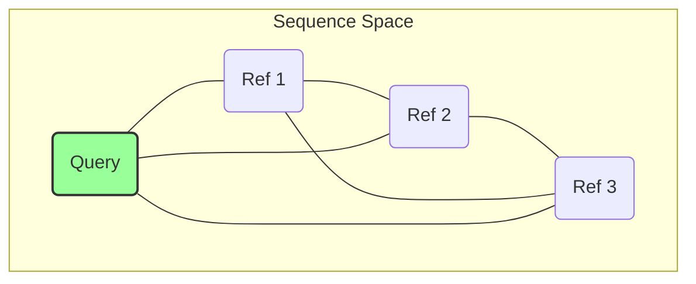
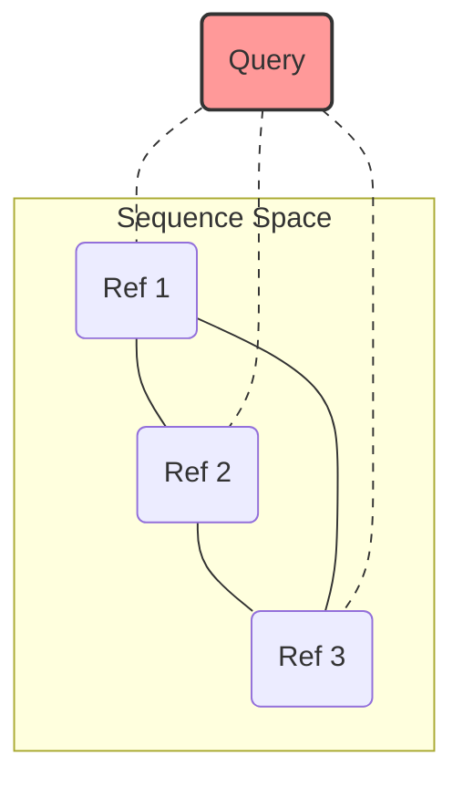

# Divergence Ratio: A "Phylo-Lite" Quality Metric

**File:** `DIVERGENCE_RATIO.md`

AnnoQC introduces **Divergence Ratio** as a high-throughput, alignment-based proxy for phylogenetic placement. Instead of building expensive phylogenetic trees (e.g., Maximum Likelihood) for every gene, we compute the relative position of the query sequence within the sequence space defined by its homologs.

## The Core Concept

Traditional quality control looks at raw identity (e.g., "Is the query >30% identical to SwissProt?"). This is flawed because protein families vary wildly in conservation.
*   **Histones (H3):** 99% conservation is expected. A 70% match is likely a pseudogene.
*   **Viral Envelopes:** 30% conservation might be a perfect match.

**Divergence Ratio** solves this by normalizing the query's similarity against the family's intrinsic diversity.

### The Formula

$$ 
\text{Divergence Ratio} = \frac{\text{Query-Panel Identity}}{\text{Panel-Panel Identity}} 
$$ 

Where:
1.  **Query-Panel Identity ($I_Q$):** The average pairwise identity between the Query and every Reference sequence in the alignment.
2.  **Panel-Panel Identity ($I_P$):** The average pairwise identity between all pairs of Reference sequences (excluding the Query).

## Visualization

Imagine the Sequence Space as a cluster of points.

### Case A: Good Gene (In-Group)
The Query falls inside or near the cluster of known homologs.



*   **Panel Identity ($I_P$):** Refs are ~80% identical to each other.
*   **Query Identity ($I_Q$):** Query is ~78% identical to Refs.
*   **Ratio:** $78 / 80 \approx 0.97$
*   **Verdict:** **High Quality.** The query evolves at the same rate as the family.

### Case B: Outlier / Artifact (Out-Group)
The Query is distant, potentially an artifact, a pseudogene, or a very distant remote homolog.



*   **Panel Identity ($I_P$):** Refs are ~80% identical (tight cluster).
*   **Query Identity ($I_Q$):** Query is only ~30% identical to Refs.
*   **Ratio:** $30 / 80 \approx 0.37$
*   **Verdict:** **Low Quality.** The query is "diverging" far faster than the background rate of the family.

### Case C: Diverse Family
The family itself is very diverse (e.g., rapidly evolving immune genes).

*   **Panel Identity ($I_P$):** Refs are only ~30% identical to each other.
*   **Query Identity ($I_Q$):** Query is ~30% identical to Refs.
*   **Ratio:** $30 / 30 \approx 1.0$
*   **Verdict:** **High Quality.** Even though raw identity is low, the query fits the family's profile.

---

## Technical Implementation

This metric is computed during the MSA phase (using `mafft` or `spoa`).

1.  **Alignment:** We generate a Multiple Sequence Alignment (MSA) of the Query + Top N Homologs (default 20).
2.  **Matrix Calculation:** We iterate through columns to compute pairwise identities (ignoring gap-vs-gap positions).
    *   $N$ sequences $
ightarrow$ $O(N^2)$ comparisons. Since $N \le 20$, this is negligible (milliseconds).
3.  **Divergence Score Calculation:**
    The raw ratio is mapped to a score [0, 1]:
    *   **Ratio $\ge$ 0.8:** Score = 1.0 (Perfect)
    *   **Ratio < 0.5:** Score = 0.0 (Penalized)
    *   **Between 0.5 and 0.8:** Linear ramp.

```rust
// Simplified Logic
let ratio = query_identity / panel_identity;
if ratio >= 0.8 { return 1.0; }
if ratio < 0.5 { return 0.0; }
return (ratio - 0.5) / 0.3;
```

## Difference from Taxonomy

The **Divergence Ratio** is purely sequence-based. It does not know that "Ref 1 is Human" and "Ref 2 is Mouse."

*   **Taxonomy Pillar:** Checks if the lineage labels match (e.g., "Is this a Mammal gene?").
*   **Divergence Pillar:** Checks if the sequence evolution makes sense (e.g., "Is this sequence mutating too fast?").

**They are complementary.** A query can have perfect Taxonomic Congruence (all hits are Mammals) but a poor Divergence Ratio (it is a frameshifted pseudogene that looks like a "messed up" Mammal gene).

## Interpretation Guide

| Ratio | Status | Likely Cause |
| :--- | :--- | :--- |
| **~1.0** | **Excellent** | Query is a standard member of the protein family. |
| **>1.0** | **Central** | Query is *more* similar to the consensus than individual refs (often the "centroid"). |
| **0.5 - 0.8** | **Warning** | Query is somewhat distant; could be genus-specific adaptation. |
| **< 0.5** | **Critical** | Query is an outlier. Pseudogene, assembly error, or very distant homolog. |

## Usage in CLI

This metric is automatic when alignment is enabled.

**CSV Output Columns:**
*   `pairwise_identity`: Raw identity of Query vs Refs.
*   `panel_pairwise_identity`: Identity of Refs vs Refs.
*   `divergence_ratio`: The calculated ratio.
*   `divergence_score`: The penalized score [0,1].

**Config:**
To adjust the weight of this metric in the final score:

```toml
[scoring.weights]
divergence = 0.5  # Increase importance (default 0.0 in some profiles)
```
