# Scoring

AnnoQC combines pillar scores in [0,1] into a weighted average. Pillars:

- Homology (h): DIAMOND-based evidence (hit count, bitscore density, coverage agreement).
- Intrinsic (i): sequence quality (ambiguous, low-complexity, homopolymer). ORF heuristics are emitted for diagnostics but are not currently part of the intrinsic score.
- Taxonomy (t, optional): consensus-based lineage congruence (deepest node with quorum support across top hits; penalized by contamination/outlier rate).
- Domains Architecture (d, optional): Pfam clan-collapsed architecture agreement vs homolog panel.
- Domains strength (ds, optional): Pfam evidence strength from the best (lowest) hmmscan e-value.
- Length Consistency (l, optional): query length vs homolog panel median using robust z-scores.
- Orphan Domain Integrity (o, optional): detects N- or C-terminal Pfam domains that align far from the model edges, a strong hint of truncated gene models.
- Subject Coverage (p, optional): rewards hits that cover the query and penalizes low subject coverage without dropping evidence. The raw score is `top_scov` (0..1) while the penalty field `subject_cov_penalty = 1 − top_scov` is emitted for diagnostics.
- Termini Concordance (u, optional): alignment-based (MAFFT/SPOA) agreement of the query’s start and end with the homolog panel. Requires ≥5 aligned sequences; combines N- and C-terminal concordance into a single score.
- Divergence (v, optional): alignment-based outlier score from `divergence_ratio` (query identity vs panel identity).
- Conserved regions (c, optional): alignment-integrity score based on conserved fraction + gap/run metrics. Requires ≥10 aligned sequences.
- Genomic context (g, optional): splice-site quality from `--gff` + `--genome`.
- Structural variation (s): DIAMOND-span “different genes” signals (fusion/split/duplication) applied as a multiplicative penalty before calibration.
- Optional caps: hard score ceilings for catastrophic calls (e.g. fusion), applied before calibration so they cannot be averaged away.
- Plugins / rules (optional): user-defined penalties (Extism WASM plugins and/or Rhai rules) applied after calibration.

## Scoring flow overview

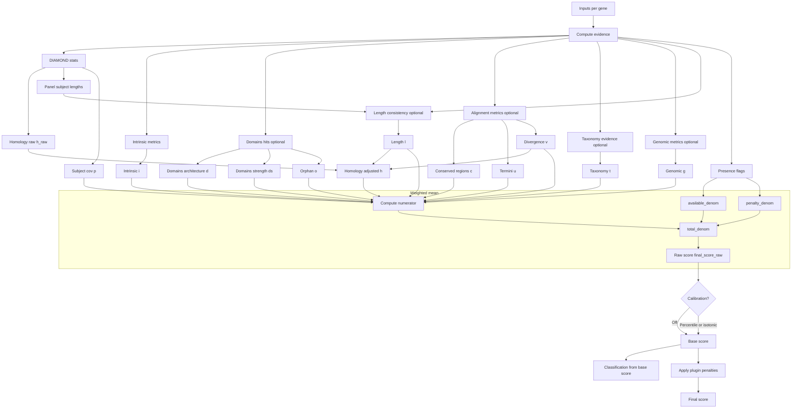

Notes on weighting:
- Each pillar contributes only if its evidence is present. Most missing pillars are excluded from the denominator.
- Homology, Domains architecture, and Domains strength are special-cased: if they are missing, their weights are still counted in the denominator, so a gene with no homology/domains evidence is penalized rather than treated as "not applicable".
- In the diagram, this is shown as `available_denom` plus a `penalty_denom` (see `src/main.rs::build_scores_map`). A future extension is to treat other run-provided evidence (e.g. RNA-seq) the same way.

## Code map (per-gene scores)

This table points to the *exact* code that defines each pillar’s value and the final weighted score.

| Pillar | Weight key | Evidence is “present” when… | Score is computed by | Combined/used by |
| --- | --- | --- | --- | --- |
| Homology (h) | `homology` | `DiamondHitStats.count > 0` | `src/scoring.rs::compute_homology_score` (raw) + `src/main.rs::adjust_homology_score` (length/divergence multipliers) | `src/main.rs::build_scores_map` |
| Intrinsic (i) | `intrinsic` | `intrinsic_map.contains_key(gene_id)` | `src/metrics.rs::compute_intrinsic` (metrics) + `src/scoring.rs::compute_intrinsic_score` (score) | `src/main.rs::build_scores_map` |
| Taxonomy (t) | `taxonomy` | taxonomy enabled AND `TaxonomyEvidence.considered > 0 || top_hit.is_some()` | `src/taxonomy.rs::TaxonomyResolver::summarize_panel` (evidence) + `src/scoring.rs::compute_taxonomy_score` (score) | `src/main.rs::build_scores_map` |
| Domains architecture (d) | `domains` | `domains_arch_map.contains_key(gene_id)` | `src/hmmer.rs::domains_architecture_diagnostics` (score) | `src/main.rs::build_scores_map` |
| Domains strength (ds) | `domains_strength` | HMMER enabled AND `hmmsum_map.contains_key(gene_id)` | `src/scoring.rs::compute_domains_strength_score` (from `HmmscanSummary.top_evalue`) | `src/main.rs::build_scores_map` |
| Length consistency (l) | `length` | `len_map.contains_key(gene_id)` | `src/length.rs::compute_length_consistency` (score + z + ratio + class) | `src/main.rs::build_scores_map` + `src/main.rs::adjust_homology_score` |
| Orphan domain (o) | `orphan` | orphan analysis enabled AND `orphan_map.contains_key(gene_id)` | `src/hmmer.rs::analyze_orphan_domains` | `src/main.rs::build_scores_map` |
| Subject coverage (p) | `subject_cov` | same as homology present | `src/scoring.rs::compute_subject_cov_score` (+ `compute_subject_cov_penalty` diagnostic) | `src/main.rs::build_scores_map` |
| Termini (u) | `termini` | `AlignmentMetrics.mafft_enabled && sequences_aligned >= src/mafft.rs::MIN_PANEL_FOR_TERMINI` | termini metrics in `src/mafft.rs` (see `compute_alignment_metrics`) | `src/main.rs::build_scores_map` |
| Divergence (v) | `divergence` | `AlignmentMetrics.sequences_aligned > 0` | `src/scoring.rs::compute_divergence_score` (from `AlignmentMetrics.divergence_ratio`) | `src/main.rs::build_scores_map` + `src/main.rs::adjust_homology_score` |
| Conserved regions (c) | `conserved_regions` | `AlignmentMetrics.mafft_enabled && sequences_aligned >= src/mafft.rs::MIN_PANEL_FOR_CONSERVED_REGIONS` | `src/scoring.rs::compute_conserved_regions_score` | `src/main.rs::build_scores_map` |
| Genomic (g) | `genomic` | `genomic_map.contains_key(gene_id)` | `src/genomic.rs::analyze_gff_context` (metrics) + `src/scoring.rs::compute_genomic_score_with_cfg` (score) | `src/main.rs::build_scores_map` |
| Structural variation penalty | *(n/a)* | homology hits present | `src/structvar.rs::analyze` (diagnostics) + `src/scoring.rs::compute_structvar_multiplier` (multiplier) | applied in `src/main.rs::build_scores_map` (pre-calibration) |
| Calibration | *(n/a)* | dataset-level | `src/main.rs::{apply_percentile_calibration, apply_isotonic_calibration}` | `src/main.rs::build_scores_map` |
| Plugin penalties | *(n/a)* | any plugins/rules configured | `src/main.rs::render_gene_record` (applies) + `src/plugins.rs::run_plugin` + `src/rhai_rules.rs::RhaiRuntime::run` | applied after `build_scores_map` |

Important: divergence and length are used in two places when present:
1) As standalone pillars (if their weights are non-zero), and
2) As multiplicative adjustments to homology via `src/main.rs::adjust_homology_score` (regardless of their weights).

## Homology pillar (h)

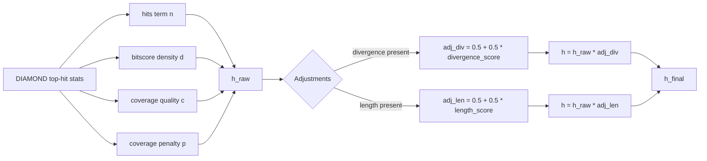

| Component | Inputs | Computation | Output |
| --- | --- | --- | --- |
| hits term `n` | `hits_count` | `n = min(hits_count / 10, 1)` | [0,1] |
| bitscore density `d` | `top_bitscore`, `top_len` | `d = min((top_bitscore / top_len) / 5, 1)` | [0,1] |
| coverage quality `c` | `top_qcov`, `top_scov` | `c = min((top_qcov + top_scov) / 2, 1)` | [0,1] |
| coverage penalty `p` | `coverage_delta` | `p = 1 - min(coverage_delta, 1)` | [0,1] |
| raw homology `h_raw` | `n, d, c, p` | `h_raw = clamp(0.3*n + 0.3*d + 0.3*c + 0.1*p)` | [0,1] |
| divergence adjustment | `divergence_score` | `adj_div = clamp(0.5 + 0.5*divergence_score)` | [0,1] |
| length adjustment | `length_score` | `adj_len = clamp(0.5 + 0.5*length_score)` | [0,1] |
| final homology `h` | `h_raw`, optional adjustments | `h = clamp(h_raw * adj_div * adj_len)` (only apply factors that are present) | [0,1] |

Implementation:
- Raw homology score: `src/scoring.rs::compute_homology_score` (inputs from `crate::diamond::DiamondHitStats`)
- DIAMOND top-hit stats: `src/diamond.rs::parse_tsv_stats`
- Length/divergence adjustments: `src/main.rs::adjust_homology_score`
- Final weighting + presence logic: `src/main.rs::build_scores_map`

### Query-centric filtering + aggregated HSPs

DIAMOND frequently reports multiple HSPs per subject, especially for large multi-domain proteins. Instead of discarding low subject coverage outright, we aggregate all HSPs for a given subject, union the spans across the query and the subject, and compute `qcov_agg` / `scov_agg` / `len_ratio` from that union. Panel Phase 1 gates on `qcov_agg` (default ≥0.70) so truncated predictions are not dropped simply because the reference sequence is much longer. `scov_agg` is retained for panel selection heuristics and diagnostics, but the *Subject Coverage pillar* is currently based on the DIAMOND top-hit `top_scov` (see `src/scoring.rs::compute_subject_cov_score`).

Implementation:
- HSP aggregation + union spans: `src/consensus.rs::aggregate_hits_by_subject` and `src/consensus.rs::union_span_len`
- Panel selection (phases + gates): `src/consensus.rs::select_panel_with_result`
- Separate DIAMOND-span analysis used for fusion/split diagnostics: `src/structvar.rs::analyze`

`panel_agg_debug.csv` shows the aggregated spans per query with the selection phase, source (SwissProt/refprot), and the dynamic length window that was applied. When a gene only aligns to a short region of the reference (e.g., N-terminal fragment), you will see `len_ratio < 1` and `subject_cov_penalty > 0` but the hit remains available for MAFFT/HMMER, allowing downstream pillars to salvage partial but still informative evidence. Note: IDs added via cluster backfill have no DIAMOND row, so they don’t appear in `panel_agg_debug.csv`.

Worked example (truncation rescue): gene `g197.t1` from the head200 set initially had only 3 SwissProt hits covering ~40% of the reference. Aggregating HSPs lifted `qcov_agg` to 0.83; the panel then triggered refprot backfill to reach 8 homologs, MAFFT ran, and start_concordance flagged `LikelyNTruncated`, which ultimately reduced the final score without forcing the gene into `NoData`.

### Cluster backfill (expand panels beyond top hits)

When a gene has too few eligible DIAMOND subjects to reach the consensus panel minimum (`selected.len() < [consensus].min_hits`), AnnoQC can **backfill** additional panel IDs from precomputed DIAMOND clusters.

Key points:
- This expands the **panel IDs** used by downstream optional stages (alignment, reference hmmscan comparisons); it does **not** create new DIAMOND evidence, so it does not directly increase the homology pillar.
- Backfilled members are only used as extra sequences to align / compare against.

Implementation:
- Cluster file loader: `src/clusters.rs::load_cluster_map`
- Analyze-side auto-load (if `clusters.recluster` exists): consensus setup in `src/main.rs`
- Backfill logic and counters: `src/consensus.rs::finalize_with_backfill` (`PanelStats.backfill_from_clusters`)
- Panel provenance export: consensus loop in `src/main.rs` (`panel_provenance.panel_cluster`)

How to audit it:
- `panel_debug.csv` includes `backfill_from_clusters` per gene.
- `panel_sources.csv` and the JSON `panel_provenance.cluster` count how many final panel IDs came from cluster backfill.

Weights and thresholds
- Configure in `config.example.toml` under `[scoring.weights]` and `[scoring.thresholds]`.
- Optional hard caps are configured under `[scoring.caps]` (e.g. cap fusion calls so they can’t be averaged away).
- Example defaults: `homology=0.6`, `intrinsic=0.4`, others `0.0`.
- New default includes `conserved_regions=0.1` and reduces intrinsic to `0.3` (see `src/main.rs::scoring_weights`).

Outputs
- JSONL:
  - `final_score_raw` is the *raw weighted mean* before calibration and before any plugin penalties (`src/main.rs::build_scores_map`).
  - `classification` is computed from the calibrated “base score” inside `build_scores_map` (plugin penalties do not currently recompute the label).
  - `final_score` is the reported score after plugin penalties: `final_score = clamp(base_score - plugins.total_penalty)` (see `src/main.rs::render_gene_record`).
  - `score_components` includes the per-pillar values that feed the weighted mean (homology is the adjusted value `h`, domains is `domains_arch_score`, etc.), plus `structvar_multiplier` which is applied as a multiplicative penalty before calibration.
- CSV:
  - `final_score` is the reported score after plugin penalties (same semantics as JSONL).
  - `--csv-verbose` includes `structvar_multiplier` plus `homology_score,intrinsic_score,taxonomy_score,domains_arch_score,orphan_domain_score,length_score,conserved_regions_score,subject_cov_score,termini_score,divergence_score,genomic_score` and plugin columns (`plugin_penalty`, `plugin_*`).
  - “standard” CSV keeps a smaller set but still includes `domains_arch_score`, `orphan_domain_score`, `genomic_score`, taxonomy fields, and plugin columns (see `src/ecs.rs` CSV headers).

Score mechanics by pillar

### Intrinsic (i)

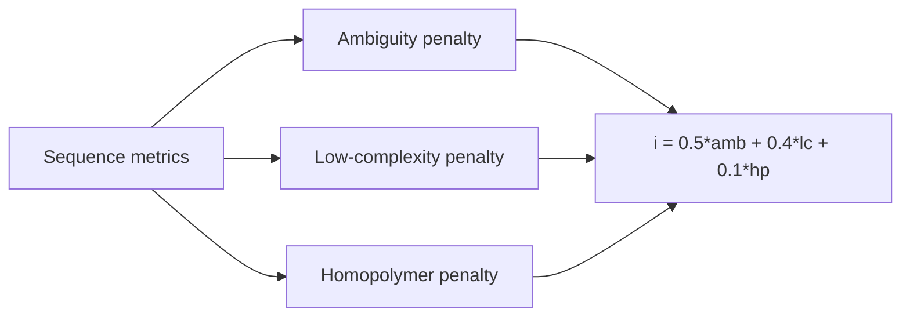

| Component | Inputs | Computation | Output |
| --- | --- | --- | --- |
| ambiguity penalty | `ambiguous_fraction` | `amb = 1 - min(ambiguous_fraction, 1)` | [0,1] |
| low-complexity penalty | `low_complexity_fraction` | `lc = 1 - min(low_complexity_fraction, 1)` | [0,1] |
| homopolymer penalty | `max_homopolymer` | `hp = 1 - min(max_homopolymer / 30, 1)` | [0,1] |
| intrinsic score | `amb, lc, hp` | `i = clamp(0.5*amb + 0.4*lc + 0.1*hp)` | [0,1] |

Implementation:
- Intrinsic metrics: `src/metrics.rs::compute_intrinsic` (computed per gene by `src/main.rs::compute_intrinsic_for_ids`)
- Intrinsic score: `src/scoring.rs::compute_intrinsic_score`

### Taxonomy (t)

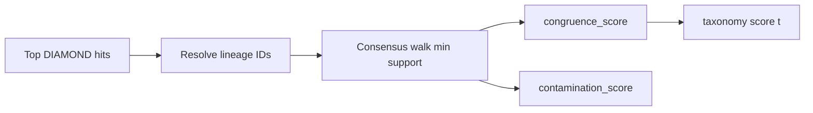

| Component | Inputs | Computation | Output |
| --- | --- | --- | --- |
| congruence score | `TaxonomyEvidence.congruence_score` | `t = clamp(congruence_score)` (non-finite -> 0) | [0,1] |
| contamination (diagnostic) | `TaxonomyEvidence.contamination_score` | `contam = 1 - support_fraction` | [0,1] |

Implementation:
- Evidence + consensus logic: `src/taxonomy.rs::TaxonomyResolver::summarize_panel` (configured via `TaxonomyConsensusConfig`)
- Score extraction/clamping: `src/scoring.rs::compute_taxonomy_score`
- Presence gating + weighting: `src/main.rs::build_scores_map`

### Domains architecture (d)

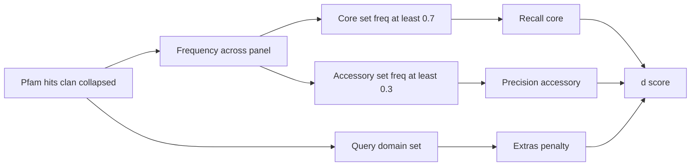

| Component | Inputs | Computation | Output |
| --- | --- | --- | --- |
| core/accessory sets | clan-collapsed domains across panel | core if freq >= 0.7; accessory if freq >= 0.3 | sets |
| recall (core) | query vs core | `recall_core = core_hits / core_count` | [0,1] |
| precision (accessory) | query vs accessory | `precision_acc = acc_hits / (query_noncore)` | [0,1] |
| extras penalty | query-only domains | `extras_pen = extras / (query_noncore)` | [0,1] |
| architecture score | above terms | `d = clamp(0.6*recall_core + 0.3*precision_acc - 0.1*extras_pen)` | [0,1] |

Implementation:
- Query hmmscan: `src/hmmer.rs::run_hmmscan` (executed via the heavy pipeline in `src/main.rs`)
- Optional clan collapse: `src/hmmer.rs::collapse_by_clan` + `src/hmmer.rs::load_pfam_clans`
- Architecture scoring: `src/hmmer.rs::domains_architecture_diagnostics` (used in `src/main.rs` to populate `domains_arch_map`)

### Domains strength (ds)


| Component | Inputs | Computation | Output |
| --- | --- | --- | --- |
| domains strength score | `HmmscanSummary.top_evalue` | `ds = clamp(-log10(top_evalue)/20)` | [0,1] |

Notes:
- If hmmscan ran but found **no hits**, `ds = 0.0` and the weight still counts in the denominator (penalizes “no domain evidence” genes).
- This value is emitted as `domains_score` in CSV and `score_components.domains_strength` in JSON.

Implementation:
- Score mapping: `src/scoring.rs::compute_domains_strength_score`
- Weighting / denominator behavior: `src/main.rs::build_scores_map`

### Orphan domain integrity (o)

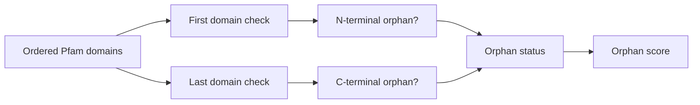

| Component | Inputs | Computation | Output |
| --- | --- | --- | --- |
| N-terminal orphan | first domain | `hmm_len >= 60` and `hmm_from > 20` | boolean |
| C-terminal orphan | last domain | `hmm_len >= 60` and `(hmm_len - hmm_to) > 20` | boolean |
| orphan status | flags | `None`, `NTerminalOrphan`, `CTerminalOrphan`, `BothOrphans` | enum |
| orphan score | flags | `score = 1 - 0.5*(has_n + has_c)` | {1.0, 0.5, 0.0} |

Implementation:
- Orphan analysis: `src/hmmer.rs::analyze_orphan_domains` (enabled/disabled in `src/main.rs` via config + `--disable-orphan-analysis`)

### Length consistency (l)

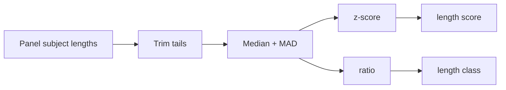

| Component | Inputs | Computation | Output |
| --- | --- | --- | --- |
| trimmed panel lengths | subject lengths | trim 10% tails when >= 10 samples | lengths |
| robust z-score | query + panel | `madn = max(1.4826*MAD, 1)`; `z = (Lq - median) / madn` | real |
| length ratio | query + panel | `ratio = Lq / median` | real |
| length score | z-score + expected-range penalty | `z_score = exp(-abs(z)/2)`; `range_penalty = 1 if Lq in [min,max] else exp(-delta/(2*madn))`; `l = clamp(z_score * range_penalty)` | [0,1] |
| length class | ratio | `<0.8 => LikelyNTruncated`, `>1.2 => LikelyNExtended`, else `InRange` | label |
| expected length range (diagnostic) | trimmed panel lengths | `expected_len_min = min(panel_lengths)`; `expected_len_max = max(panel_lengths)` | lengths |
| in expected range (diagnostic) | query length + range | `in_expected_range = expected_len_min <= Lq <= expected_len_max` | boolean |

Implementation:
- Length consistency: `src/length.rs::compute_length_consistency`
- Subject lengths are taken from the selected panel in `src/main.rs` (see the consensus loop that builds `len_map`)

### Subject coverage (p)

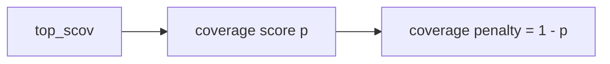

| Component | Inputs | Computation | Output |
| --- | --- | --- | --- |
| subject coverage score | `top_scov` | `p = clamp(top_scov)` | [0,1] |
| coverage penalty (diagnostic) | `top_scov` | `penalty = 1 - p` | [0,1] |

Implementation:
- Score/penalty: `src/scoring.rs::{compute_subject_cov_score, compute_subject_cov_penalty}`
- Input `top_scov` comes from `src/diamond.rs::parse_tsv_stats`

### Termini concordance (u)

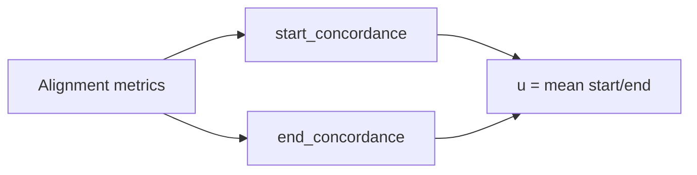

| Component | Inputs | Computation | Output |
| --- | --- | --- | --- |
| start concordance | aligned starts | median(panel starts); `diff = query_start - median`; `start = clamp(1 - abs(diff)/30)` | [0,1] |
| start class | `diff` | `LikelyComplete` if `|diff|<=3`, `LikelyNTruncated` if `diff>3`, else `LikelyNExtended` | label |
| end concordance | aligned ends | median(panel ends); `diff_end = query_end - median`; `end = clamp(1 - abs(diff_end)/30)` | [0,1] |
| end class | `diff_end` | `LikelyComplete` if `|diff_end|<=3`, `LikelyCTruncated` if `diff_end<-3`, else `LikelyCExtended` | label |
| termini score | start/end concordance | `u = (start_concordance + end_concordance)/2` (only if panel >= 5) | [0,1] |

Implementation:
- Terminus metrics are computed inside `src/mafft.rs` (see `compute_alignment_metrics`) and gated by `src/mafft.rs::MIN_PANEL_FOR_TERMINI`.
- Termini pillar uses `(start_concordance + end_concordance)/2` in `src/main.rs::build_scores_map`.

### Divergence (v)

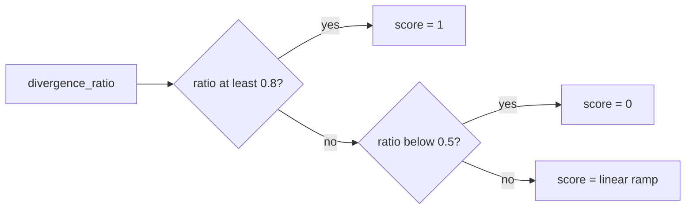

| Component | Inputs | Computation | Output |
| --- | --- | --- | --- |
| divergence score | `divergence_ratio` | `1` if >= 0.8, `0` if < 0.5, else `(r - 0.5)/0.3` | [0,1] |

Implementation:
- `divergence_ratio`: `src/mafft.rs` (`AlignmentMetrics.divergence_ratio`)
- Score mapping: `src/scoring.rs::compute_divergence_score`
- Used both as an optional pillar and as a homology adjustment: `src/main.rs::{build_scores_map, adjust_homology_score}`

### Conserved regions (c)

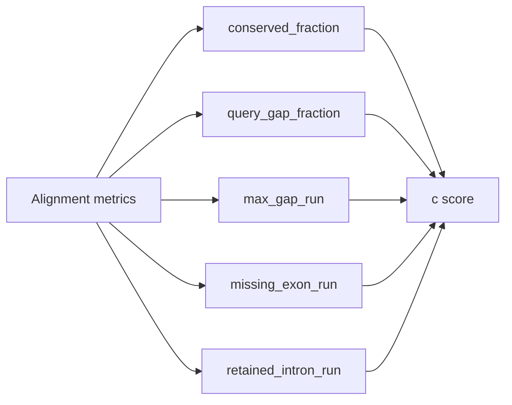

Presence and gating:
- Only computed and included when `AlignmentMetrics.mafft_enabled && sequences_aligned >= src/mafft.rs::MIN_PANEL_FOR_CONSERVED_REGIONS` (default 10).

| Component | Inputs | Computation | Output |
| --- | --- | --- | --- |
| conserved regions score | alignment metrics | `c = clamp(0.55*conserved + 0.20*gap_pen + 0.15*run_pen + 0.05*missing_pen + 0.05*intron_pen)` | [0,1] |

Implementation:
- Score mapping: `src/scoring.rs::compute_conserved_regions_score`
- Presence gating + weighting: `src/main.rs::build_scores_map`

### Structural variation penalty (s)

This captures “different genes” signals from GV: suspected fusions, splits, or internal duplications based on the layout of DIAMOND HSPs across the query.

It is **not** a weighted-mean pillar today; instead it is applied as a **multiplicative penalty** before calibration:

- `final_score_raw = weighted_mean * structvar_multiplier`
- Optional: apply hard caps from `[scoring.caps]` after the multiplier (still pre-calibration).

| Classification | Multiplier | Effect |
| --- | --- | --- |
| `None` | 1.00 | no change |
| `InternalDuplicationPossible` | 0.70 | moderate detriment |
| `SplitPossible` | 0.20 | major detriment |
| `FusionPossible` | 0.05 | extreme detriment |

Implementation:
- HSP-layout analysis: `src/structvar.rs::analyze`
- Multiplier mapping: `src/scoring.rs::compute_structvar_multiplier`
- Applied pre-calibration: `src/main.rs::build_scores_map`
- Optional caps: `src/main.rs::ScoringCapsConfigOverride` + `src/main.rs::build_scores_map`

### Genomic context (g)

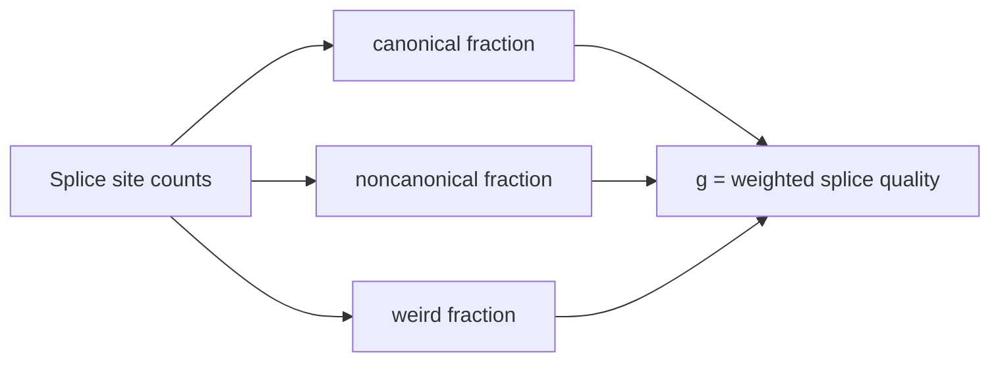

| Component | Inputs | Computation | Output |
| --- | --- | --- | --- |
| genomic score | splice site counts | `g = 0.7*canonical + 0.2*(1-noncanonical) + 0.1*(1-weird)` with optional thresholds | [0,1] |

Implementation:
- Per-gene splice counts: `src/genomic.rs::analyze_gff_context`
- Score mapping + optional thresholds: `src/scoring.rs::compute_genomic_score_with_cfg`
- Note: `introns_total == 0` yields `g = 1.0` in `compute_genomic_score_with_cfg` (single-exon genes are not penalized).

### Final score + calibration

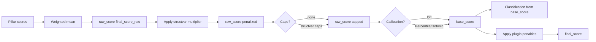

| Component | Inputs | Computation | Output |
| --- | --- | --- | --- |
| weighted mean | pillar scores + weights + presence | `raw = sum(w_i*s_i for present pillars) / denom` where `denom = sum(w_i for present pillars)` **plus** `w_homology` if homology is missing and `w_domains` if domains is missing | [0,1] |
| calibration | `raw` | optional percentile or isotonic remap (dataset-level) | [0,1] |
| classification | calibrated “base score” | `High` if >= high, `Medium` if >= medium, else `Low` (optionally annotate missing pillars) | label |
| plugin penalty | plugin/rule outputs | `final_score = clamp(base_score - sum(plugin_penalties))` | [0,1] |

Implementation:
- Weights/thresholds/presence + raw score: `src/main.rs::build_scores_map`
- Homology/domains “missing still counts” denominator rule: `src/main.rs::build_scores_map`
- Calibration: `src/main.rs::{apply_percentile_calibration, apply_isotonic_calibration, calibration_has_min_samples}`
- Plugin penalties: computed + applied in `src/main.rs::render_gene_record` using `src/plugins.rs::run_plugin` and `src/rhai_rules.rs::RhaiRuntime::run`

Note: the reported `classification` is computed from the calibrated “base score” inside `src/main.rs::build_scores_map`. Plugin penalties are applied afterwards and do not currently recompute the classification label.

Formulas (implemented)

- Homology h
  - Inputs: DIAMOND `bitscore`, `length`, `qcovhsp`, `scovhsp`, `pident`.
  - bitscore density d = clamp(bitscore / max(length, 1) / 5, 0, 1).
  - coverage quality c = (qcovhsp + scovhsp)/2; penalty p = 1 − min(|qcovhsp − scovhsp|, 1).
  - hits term n = min(hits/10, 1).
  - raw h_raw = clamp(0.3·n + 0.3·d + 0.3·c + 0.1·p, 0, 1). Implemented in `src/scoring.rs::compute_homology_score`.
  - adjusted h = h_raw × adj_div × adj_len where `adj_* = 0.5 + 0.5*score_*` if the corresponding evidence is present. Implemented in `src/main.rs::adjust_homology_score`.

- Intrinsic i
  - i = clamp(0.5·(1 − ambiguous_fraction) + 0.4·(1 − low_complexity_fraction) + 0.1·(1 − max_homopolymer/30), 0, 1). Implemented in `src/scoring.rs::compute_intrinsic_score`.

- Taxonomy t
  - Inputs: top `[taxonomy].top_hits` DIAMOND subjects (default 20), sorted by bitscore, de-duplicated by canonical accession.
  - Collect lineage IDs for all resolved hits and pick the deepest taxon that is supported by a quorum of hits: `quorum = ceil(min_support * considered)`.
  - Let `support_fraction = support_hits / considered_hits` and compute a depth-normalized congruence: `t = clamp(support_fraction · depth_norm, 0, 1)` (see `src/taxonomy.rs::TaxonomyResolver::summarize_panel`).
  - If no fine-grained quorum taxon exists, fall back to a coarse consensus at `coarse_rank_index` when `coarse_min_support` is met.
  - Contamination is surfaced separately as `contamination = 1 − support_fraction`.

- Domains architecture d (Pfam clan-collapsed)
  - Collapse accessions→clans; for each clan, compute frequency across homolog panel.
  - Core if freq≥0.7; Accessory if freq≥0.3.
  - d = clamp(0.6·recall_core + 0.3·precision_acc − 0.1·extras_pen, 0, 1).

- Length consistency l
  - Let Lq be query length; Ls subject lengths from the consensus panel.
  - Trim tails (10%) when panel sizes are large (≥10) to reduce outlier influence.
  - median m = median(Ls), robust spread MADn = 1.4826·MAD(Ls).
  - z = (Lq − m) / max(MADn, 1.0).
  - l = exp(−|z|/2). Also report length_ratio = Lq/m and length_class:
    - LikelyNTruncated if ratio < 0.8; LikelyNExtended if ratio > 1.2; else InRange.

- Orphan domain integrity o
  - Enabled when `hmmscan` runs (`--hmmscan-bin …`) and `[hmmer].orphan_analysis = true` (override with `--disable-orphan-analysis`).
  - Sort domains by alignment start, and inspect the first and last domains only.
  - Flag the N-terminal domain if it begins >20 HMM residues away from the model start (and the HMM length ≥60 aa). Flag the C-terminal domain if it ends >20 residues shy of the model end.
  - o = 1.0 when no domain is flagged, 0.5 when only one terminus looks truncated, and 0.0 when both N and C appear truncated. JSON/CSV expose `orphan_status` along with the Pfam accession(s) that triggered the warning.

- Subject coverage p
  - p = clamp(top_scov, 0, 1). Implemented in `src/scoring.rs::compute_subject_cov_score`.

- Genomic context g
  - Enabled with `--gff` + `--genome` inputs.
  - g rewards canonical splice sites and penalizes excessive non-canonical or weird junctions.
  - Optional thresholds can downweight the genomic score when splice motifs are weak:
    - `[scoring.genomic].min_canonical` (default 0.6)
    - `[scoring.genomic].max_noncanonical` (default 0.3)
    - `[scoring.genomic].max_weird` (default 0.2)

- Divergence v
  - v is derived from MAFFT/SPOA `divergence_ratio` and mapped to [0,1] with a piecewise linear ramp. Implemented in `src/scoring.rs::compute_divergence_score`.

- Calibration (optional)
  - Enable with `--calibration-mode Percentile|Isotonic` or `[calibration].mode = "Percentile|Isotonic"` to remap scores within the current dataset; leave it `Off` (default) to report raw weighted scores.
  - Calibrations are skipped when the run has too few genes or too few unique scores; adjust `[calibration].min_samples` or `[calibration].min_unique` if needed.
  - The raw (pre-calibration) score is still emitted as `final_score_raw` in JSONL for auditing.

- Termini concordance u (gated)
  - Alignment-based assessment of whether the query begins and ends where the homolog panel typically does.
  - Requires a homolog panel of at least `min_hits` (default 5). If panel_size < `min_hits`, MAFFT is skipped and both concordance measures are omitted (JSON/CSV show `InsufficientPanel`).
  - Computation (when enabled): align query + panel with MAFFT. Compare the query’s first/last non-gap column to the panel median at each terminus, scaled by a 30 aa tolerance.
  - start_class: LikelyComplete (|Δ|≤3), LikelyNTruncated (Δ>3), LikelyNExtended (Δ<−3).
  - end_class: LikelyComplete (|Δ|≤3), LikelyCTruncated (Δ<−3), LikelyCExtended (Δ>3).
  - u = (start_concordance + end_concordance)/2 when MAFFT ran; otherwise u = 0.

- Final score
  - raw_score (aka `final_score_raw`) is computed in `src/main.rs::build_scores_map` using the per-pillar weights and presence rules (missing pillars excluded, except homology/domains which still contribute to the denominator when missing).
  - base_score is optionally calibrated (Percentile/Isotonic).
  - final_score = clamp(base_score − plugin_penalty). Penalties come from Extism plugins and/or Rhai rules; see `src/main.rs::render_gene_record`.

Thresholds and classification
- High if final_score ≥ high; Medium if final_score ≥ medium; else Low. Defaults: high=0.8, medium=0.5.

Worked example (a9_head200)

Config weights: `homology=0.5, intrinsic=0.3, domains=0.1, length=0.1, taxonomy=0.0`.

```
final_score ≈ 0.86
homology ≈ 0.78, intrinsic ≈ 0.99, domains_arch_score ≈ 0.65, length_score ≈ 0.99
length_ratio ≈ 1.00 (InRange), start_concordance ≈ 1.0 (LikelyComplete)
```

Notes & caveats
- Coverage uses DIAMOND `qcovhsp/scovhsp` when available; we request `qlen/slen` to enable robust length metrics.
